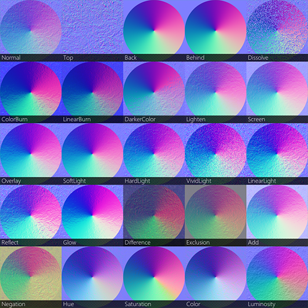
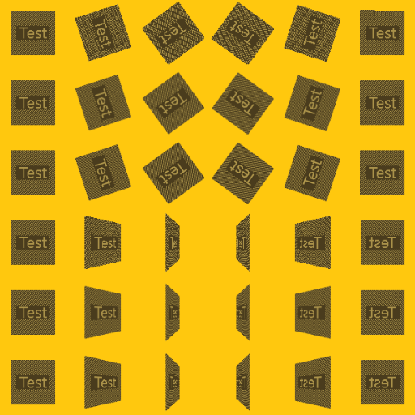
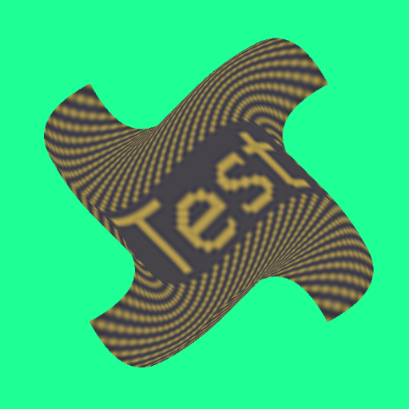
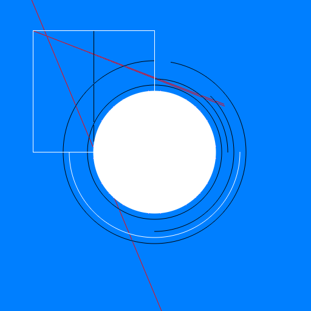
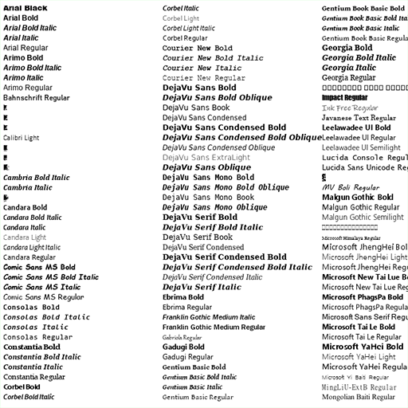
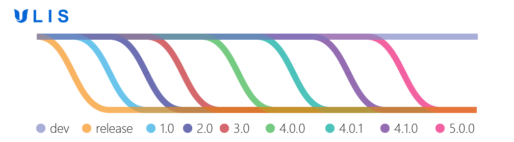

## 
 

    

## Overview
ULIS is a rendering library written in C++. It is aimed at software rasterization and digital image processing.
- [Official Github Repository](https://github.com/Praxinos/ULIS)
- [Praxinos Website](https://praxinos.coop/)
- [Documentation](https://praxinos.coop/Documentation/ULIS/Developer/version/dev/html/)
- [License](LICENSE.md)

## Samples
 |  |  | 
---- | ---- | ----
 |  |  | 

## Workflow

    

The dev branch contains work in progress and may be unstable most of the time. We advise checking out the release branch to try and build the latest stable ULIS version.

## Build and Documentation
Check the [documentation](https://praxinos.coop/Documentation/ULIS/Developer/version/dev/html/) for the API reference and details on the build process.  
